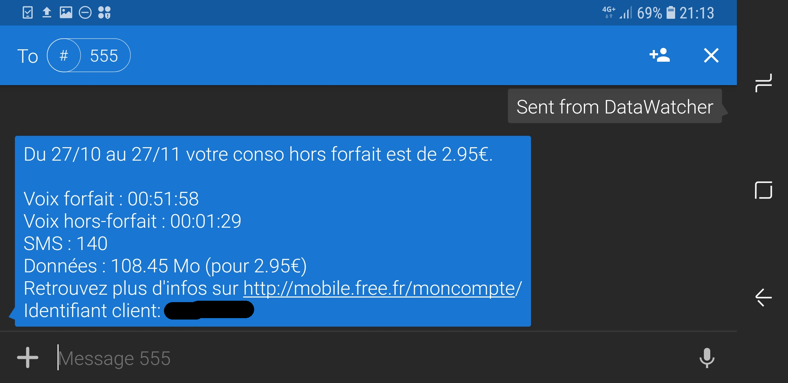
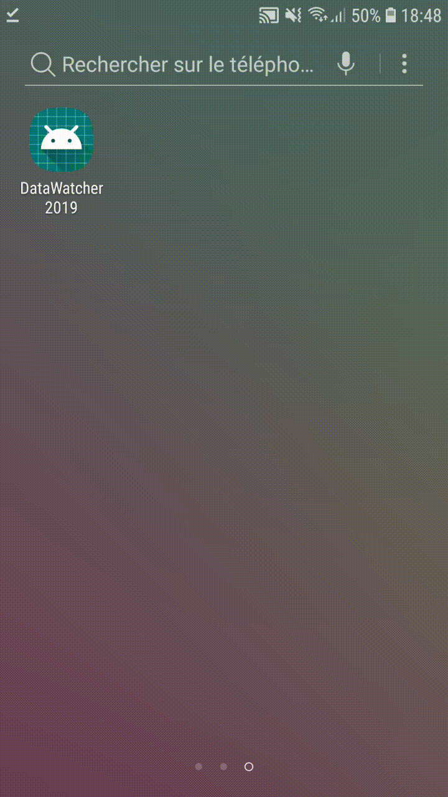

## Datawatcher - Monitoring my phone's data usage 

**Free** is a phone carrier operating in France that lets users see their plan 
usage in the current month by sending an SMS to 555. The user then
receives a text message from 555 containing information about their plan usage.

Datawatcher is an Android app that sends an SMS to 555, waits for the response, 
parses it, and displays how much data the user has used during the current month to-date

</img>
 